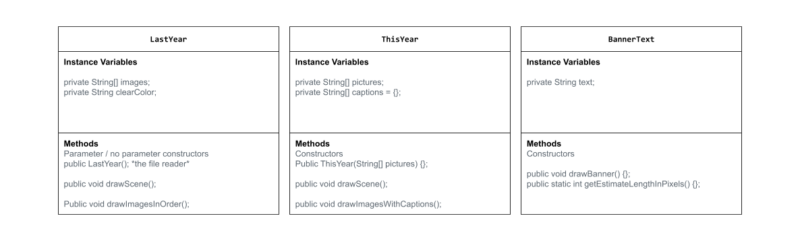

# Project: New Scene, New Me

## Introduction

Software engineers develop programs to create visual and audio experiences using object-oriented programming. As we begin 2026, your goal is to create an animation program that reflects on your experiences from 2025 and visualizes your goals and aspirations for the year ahead using the Theater and Scene API.

## Requirements

Use your knowledge of object-oriented programming, one-dimensional (1D) arrays, algorithms, and the Theater/Scene API to create your animation program:
- **Write Scene subclasses** – Create two Scene subclasses: one to visualize your 2025 recap (LastYear) and another to project your 2026 goals (ThisYear). Each class must include both a no-argument constructor and a parameterized constructor.
- **Use private instance variables** – Implement proper encapsulation by declaring instance variables as private in your Scene subclasses.
- **Create 1D arrays** – Create at least two 1D arrays to store data for your scenes. One array must be created using an initializer list, and one array must be populated by reading from a text file using the FileReader class.
- **Write a method** – Write a method that finds or manipulates the elements in a 1D array to provide the information your user needs.
- **Access and modify array elements** – Use algorithms to traverse, access, and/or modify elements in your 1D arrays to display personalized content in your scenes.
- **Use logic and iteration** – Incorporate selection statements (if/if-else) and loops (while, for, or enhanced for) to control the flow and display of content in your scenes.
Incorporate variety of media – Use at least four different types of Scene API methods across both scenes (examples: drawImage(), drawText(), drawRectangle(), drawEllipse(), playSound(), setTextStyle(), setFillColor(), etc.).
- **Create a UML diagram** – Design a UML class diagram showing your Scene subclasses with their instance variables, constructors, and methods before you begin coding.
- **Document your code** – Use multi-line comments to explain the purpose of each method (including preconditions and postconditions) and single-line comments to explain code segments.

## UML Diagram 

Put an image of your UML Diagram here. Upload the image of your UML Diagram to your repository, then use the Markdown syntax to insert your image here. Make sure your image file name is one work, otherwise it might not properly get displayed on this README. 

 

## Description of 2025 recap

My 2025 year was ok. My phone doesn't have alot of photos and I can't remember everything I did, but the most notable ones were:

- Going airsoft with friends
- Shooting guns at Las Vegas
- Breaking my curved 34 inch 180 hz gaming monitor
- Looking like a chipmunk after getting my wisdom teeth removed
## Description of 2026 goals

A couple things that happened during 2026 so far was:

- The night vision I bought last year finally arrived. However they sent me a defective device and I'm still waiting for a response back
- My friends constantly ragebait me when we play videogames. Is it them being retards or is it ragebait??
- Enjoyed just playing games like counterstrike with the same friends. Its enjoyable.
## Scene API Usage

Describe how you were able to use the various methods from the Scene API to create your animation.

I had to utilize my prior knowledge from last year despite comming back from break. I had to go back to pervious lessons and find code examples that I can refer to. I also utilized Aielo's code examples he gave us to make our presentations more "unique" like the banner texts. Various methods were equally important to ensure the code runs. I used the drawScene() method to make sure whatever I want shows up on the screen. I had to make a file reader method to make sure that the code can access my images. 